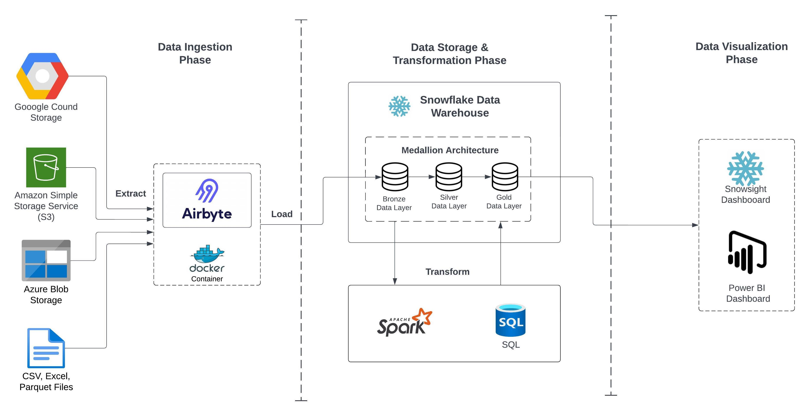
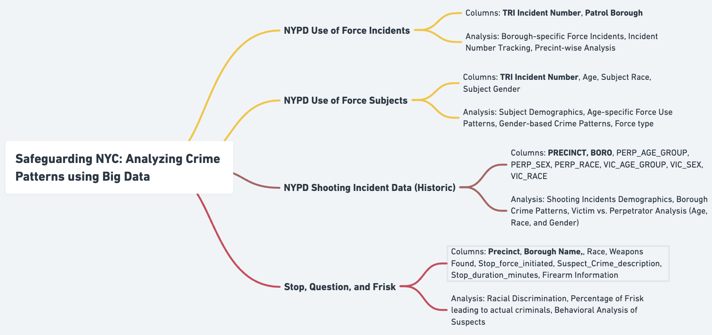

## Safeguarding NYC: Analyzing Crime Patterns using Big Data

### Objective: 
To provide an in-depth and integrated analysis of crime data from multiple sources in New York City. This study aims to identify patterns, intensities, and distributions of crimes, with the ultimate goal of aiding various stakeholders in understanding and mitigating criminal activities in NYC.

### Setup
1. Create an account on Snowflake and get your account, user, role, warehouse and database information

2. In the helpers/snowflake_config.json file, update your Snowflake Credentials
'''JSON
{
    "account": "<account>",
    "user": "<user_name>",
    "password": "<password>",
    "role" :"<user_access_role>",
    "warehouse": "<warehouse_name>",  
    "database": "<default_schema_name>"
}  
'''

### Project Architecture

### Data Ingestion using Airbyte

### Snowflake Data Warehouse: Medallion Architecture

### Data
- Data Sources and Design

- ER Diagram

## Setup/References
1. Airbyte: https://docs.airbyte.com/deploying-airbyte/local-deployment
2. Snowflake: https://docs.snowflake.com/en/user-guide-getting-started 
3. Airbyte-Snowflake: https://docs.airbyte.com/integrations/destinations/snowflake 

